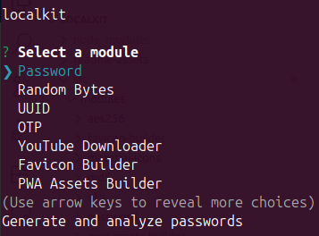

# localkit



The localkit CLI provides a series of utilities that can be used by web developers to enhance their workflow.

The modules are:

- [Password:](./readme-assets/modules/PASSWORD/README.md) generate and analyze passwords
- [UUID:](./readme-assets/modules/UUID/README.md) generate and validate UUIDs (Universally Unique Identifiers)
- [OTP:](./readme-assets/modules/OTP/README.md) generate OTP (One Time Password) secrets and tokens
- [YoutubeDownloader:](./readme-assets/modules/YOUTUBE_DOWNLOADER/README.md) download videos/audio files from YouTube
- [Favicon Builder:](./readme-assets/modules/FAVICON_BUILDER/README.md) build all the favicon files required by modern web apps
- [PWA Assets Builder:](./readme-assets/modules/PWA_ASSETS_BUILDER/README.md) build all the assets required for a PWA to be published
- [Material Icons:](./readme-assets/modules/MATERIAL_ICONS/README.md) .@TODO
- [AES256:](./readme-assets/modules/AES256/README.md) encrypt and decrypt messages with the AES256 algorithm
- [MD5:](./readme-assets/modules/MD5/README.md) hash and validate messages with the MD5 Algorithm


<br/>

## Getting Started

1) Install the CLI Globally
```bash
$ npm install -g localkit
```

2) Run it with:
```bash
$ localkit
```

<br/>

## Forking Instructions

If you wish to make use of the LocaLKit CLI to perform sensitive operations, I suggest that you fork this repository and lock all dependencies in the `package.json` file (equivalent to using the  `--save-exact` flag) for security reasons.

### Requirements

- GIT
- NodeJS ^v21.0.0
- NPM ^v10.2.0

### Installation

1) Clone the repository
```bash
$ git clone git@github.com:your-username/localkit.git
```

2) Install the dependencies
```bash
$ npm install
```

3) Run it
```bash
$ npm start
```


<br/>

## Deployment

```bash
$ npm publish
```


<br/>

## Built With

- JavaScript


<br/>

## Running the Tests

```bash
# Unit Tests
$ npm run test:unit

# Integration Tests
$ npm run test:integration
```


<br/>

## @TODO

[ ] Implement the JavaScript/Typescript/CSS file template generators


<br/>

## License

[MIT](https://choosealicense.com/licenses/mit/)


<br/>

## Acknowledgments

- [Inquirer.js](https://github.com/SBoudrias/Inquirer.js)
- [node-aes256](https://github.com/JamesMGreene/node-aes256)
- [check-password-strength](https://github.com/deanilvincent/check-password-strength)
- [date-fns](https://github.com/date-fns/date-fns)
- [generate-password](https://github.com/brendanashworth/generate-password)
- [node-md5](https://github.com/pvorb/node-md5)
- [uuid](https://github.com/uuidjs/uuid)
- [otplib](https://github.com/yeojz/otplib)
- [ytdl](https://github.com/fent/node-ytdl-core)
- [sharp](https://github.com/lovell/sharp)
- [png-to-ico](https://github.com/steambap/png-to-ico)
- [ffmpeg](https://ffmpeg.org/)


<br/>

## Sources

- [Adding favicons in a multi-browser multi-platform world](https://mobiforge.com/design-development/adding-favicons-in-a-multi-browser-multi-platform-world)
- [How to enhance your PWA with HTML tags for iOS and Android](https://www.modyo.com/developer-tips/how-to-enhance-your-pwa-with-html-tags-for-ios-and-android)
- [Adaptive icon support in PWAs with maskable icons](https://web.dev/articles/maskable-icon)
- [Define icons and a theme color](https://learn.microsoft.com/en-us/microsoft-edge/progressive-web-apps-chromium/how-to/icon-theme-color)
- [awesome-meta-and-manifest](https://github.com/gokulkrishh/awesome-meta-and-manifest)
- [PWABuilder](https://www.pwabuilder.com/imageGenerator)
- [pwa-asset-generator](https://github.com/elegantapp/pwa-asset-generator)


