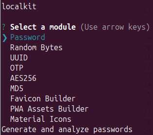

# LocalKit



The LocalKit CLI provides a series of utilities that can be used by web developers to enhance their workflow. Note that this CLI can be used when connected to the Internet and in offline mode for more sensitive operations.

The key features are:

- Generation and analysis of passwords
- Generation and validation of UUIDs (Universally Unique Identifiers)
- Generation and validation of OTP (One Time Password) secrets and tokens
- Youtube Video/Audio Files Download
- Favicon Builder
- Encryption and decryption of messages with the AES256 Algorithm
- Hashing of messages with the MD5 Algorithm


<br/>

## Getting Started

1) Install the CLI Globally
```bash
$ npm install -g localkit
```

2) Run it with:
```bash
$ localkit
```

<br/>

## Forking Instructions

If you wish to make use of the LocaLKit CLI to perform sensitive operations, I suggest that you fork this repository and lock all dependencies in the `package.json` file (equivalent to using the  `--save-exact` flag) for security reasons.

### Requirements

- GIT
- NodeJS ^v21.0.0
- NPM ^v10.2.0

### Installation

1) Clone the repository
```bash
$ git clone git@github.com:jesusgraterol/localkit.git
```

2) Install the dependencies
```bash
$ npm install
```

3) Run it
```bash
$ npm start
```


<br/>

## Deployment

```bash
$ npm publish
```


<br/>

## Built With

- JavaScript


<br/>

## Running the Tests

```bash
# Unit Tests
$ npm run test:unit

# Integration Tests
$ npm run test:integration
```


<br/>

## @TODO

- Implement the PWA Assets' Generators
- Implement the JavaScript/Typescript/CSS file template generators


<br/>

## License

[MIT](https://choosealicense.com/licenses/mit/)


<br/>

## Acknowledgments

- [Inquirer.js](https://github.com/SBoudrias/Inquirer.js)
- [node-aes256](https://github.com/JamesMGreene/node-aes256)
- [check-password-strength](https://github.com/deanilvincent/check-password-strength)
- [date-fns](https://github.com/date-fns/date-fns)
- [generate-password](https://github.com/brendanashworth/generate-password)
- [node-md5](https://github.com/pvorb/node-md5)
- [uuid](https://github.com/uuidjs/uuid)
- [otplib](https://github.com/yeojz/otplib)
- [ytdl](https://github.com/fent/node-ytdl-core)
- [sharp](https://github.com/lovell/sharp)
- [png-to-ico](https://github.com/steambap/png-to-ico)


<br/>

## Sources

- [Adding favicons in a multi-browser multi-platform world](https://mobiforge.com/design-development/adding-favicons-in-a-multi-browser-multi-platform-world)