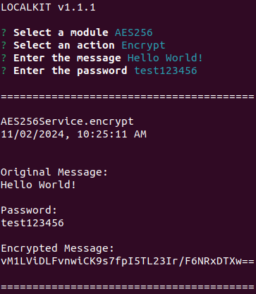
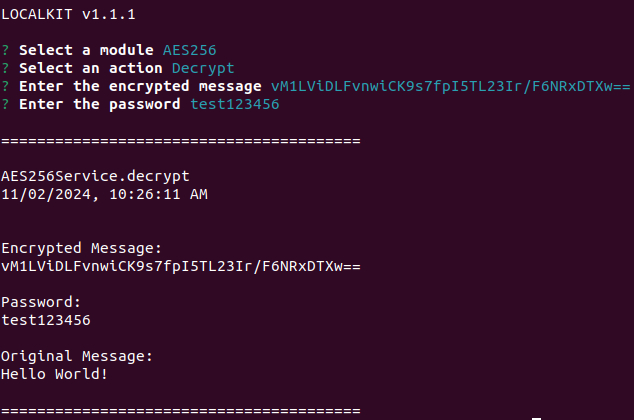

[<- Back](../../../README.md)

# AES256

The AES256 Module allows you to encrypt and decrypt strings by making use of the aes256 algorithm.

It is also important to note that this module makes use of the [node-aes256](https://github.com/JamesMGreene/node-aes256) library which allows the secret to be of any size because it is hashed using the SHA-256 algorithm.

## Encrypting a String

## Decrypting a String

