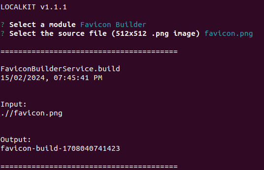

[<- Back](../../../README.md)

# Favicon Builder

The Favicon Builder Module generates all the images used by all browsers to provide the user a clear identification of the web application.

In the past, using favicons was as simple as providing a 32x32 pixels image. However, the browsing experience has evolved significantly and now the favicon can be used in many places, such as:

* next to the site name in a browser tab

* in a list of bookmarks

* as a launch icon on device homescreens and desktops

* in the address bar itself

* ...

## Getting Started

In order to generate a build, you need a 512x512 pixels image that represents the brand in `.png` format. For Example:


Launch the CLI in the directory where the required image is located and then initialize the Favicon Builder Module:

```bash
$ localkit
```




### Build Output

Once the build has completed, it will output the following contents in the directory from which you invoked the CLI:

```
favicon-build-${TIMESTAMP}
    │
    favicon.ico
    source.png
    favicons/
        ├───16x16.png
        ├───32x32.png
        ├───48x48.png
        ├───64x64.png
        ├───96x96.png
        ├───112x112.png
        ├───128x128.png
        ├───144x144.png
        ├───160x160.png
        ├───176x176.png
        ├───192x192.png
        ├───208x208.png
        ├───224x224.png
        ├───240x240.png
        ├───256x256.png
        ├───384x384.png
        └───512x512.png
```

### Usage

1. Include the favicon.ico into the project's root
2. Place the `favicons` directory inside of the project's root. Resulting in `/${PROJECT_ROOT}/favicons`
3. Include the tags within the `<head>...</head>`:
```html
<!-- Favicon -->
<link rel="icon" type="image/png" sizes="512x512" href="favicons/512x512.png">
<link rel="icon" type="image/png" sizes="384x384" href="favicons/384x384.png">
<link rel="icon" type="image/png" sizes="256x256" href="favicons/256x256.png">
<link rel="icon" type="image/png" sizes="240x240" href="favicons/240x240.png">
<link rel="icon" type="image/png" sizes="224x224" href="favicons/224x224.png">
<link rel="icon" type="image/png" sizes="208x208" href="favicons/208x208.png">
<link rel="icon" type="image/png" sizes="192x192" href="favicons/192x192.png">
<link rel="icon" type="image/png" sizes="176x176" href="favicons/176x176.png">
<link rel="icon" type="image/png" sizes="160x160" href="favicons/160x160.png">
<link rel="icon" type="image/png" sizes="144x144" href="favicons/144x144.png">
<link rel="icon" type="image/png" sizes="128x128" href="favicons/128x128.png">
<link rel="icon" type="image/png" sizes="112x112" href="favicons/112x112.png">
<link rel="icon" type="image/png" sizes="96x96" href="favicons/96x96.png">
<link rel="icon" type="image/png" sizes="64x64" href="favicons/64x64.png">
<link rel="icon" type="image/png" sizes="48x48" href="favicons/48x48.png">
<link rel="icon" type="image/png" sizes="32x32" href="favicons/32x32.png">
<link rel="icon" type="image/png" sizes="16x16" href="favicons/16x16.png">
```


## Source

[Adding favicons in a multi-browser multi-platform world](https://mobiforge.com/design-development/adding-favicons-in-a-multi-browser-multi-platform-world)