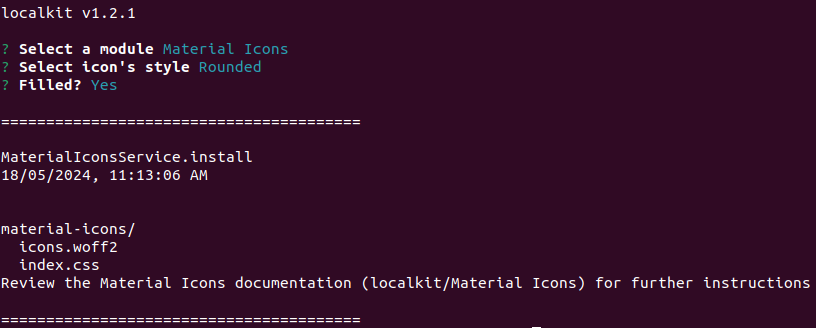

[<- Back](../../../README.md)

# Material Icons

The Material Icons Module downloads the icons' font for any style directly from the [Official Repository](https://github.com/google/material-design-icons) and generates the CSS module so it can be easily imported into your app.


</br>

## Getting Started

Say your project has the following structure:

```
my-project
    │
    node_modules/
    │    └───...
    public/
    │    └───...
    src/
    │  ├───components/
    │  │       └───...
    │  ├───stylesheets/
    │  │       ├───modules/
    │  │       │       └───...
    │  │       └───index.css
    │  └───...
    │
    index.html
    package.json
    tsconfig.json
```

Navigate to the `modules` directory:

```bash
$ cd my-project/src/stylesheets/modules
```

Initialize `localkit` and launch the `Material Icons` Module:

```bash
~/my-project/src/stylesheets/modules$ localkit
```




</br>


## Installation Output

Once the execution has completed, it will output the following contents in the directory from which you invoked the CLI:


```
material-icons
    │
    icons.woff2
    index.css
```


</br>

## Usage

Import the Material Icons' generated stylesheet in your main stylesheet:

```css
@import url('modules/material-icons/index.css');
```

Finally, use any icon in your `html`:

```html
<span class="md-icon">home</span>

<!-- large icon -->
<span className="md-icon md-72">code</span>
```


</br>

## Sources

- [Material Symbols Guide](https://developers.google.com/fonts/docs/material_symbols)