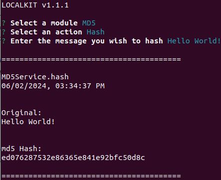
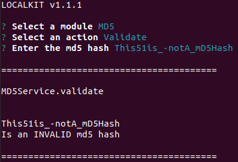

[<- Back](../../../README.md)

# MD5

The MD5 Module (Message-Digest Algorithm) allows you to hash any string. It is very useful for 
authenticating messages and digital signatures.

Moreover, this module is also capable of validating MD5 Hashes:

