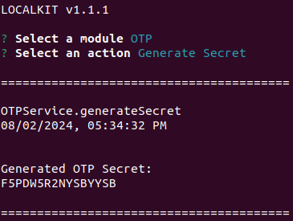
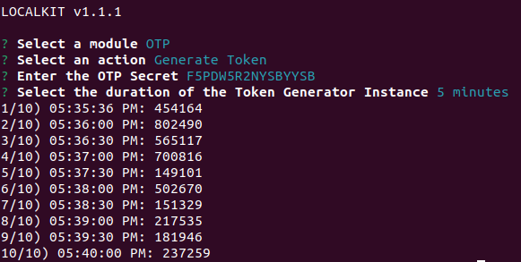

[<- Back](../../../README.md)

# OTP

The OTP Module allows you to generate Secrets for the generation of One Time Password Tokens, fully compatible
with Google Authenticator.

It can also generate tokens for a custom time interval that comes very handy during the development phase:

