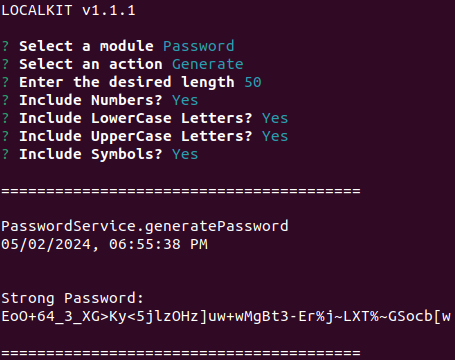
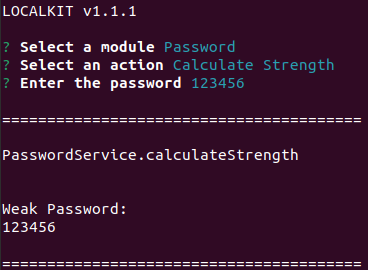

[<- Back](../../../README.md)

# Password

The password module allows you to generate strong (pseudo-random), fully customizable passwords that can be used as credential for any application or environment variable secrets.  

It is good practice to make use of long passwords (LocalKit defaults to a length of 50) and include letters, numbers and special characters.

**Note:** to avoid issues when working with `.env` files, passwords will never include the following characters:

- `"`
- `\`
- `'`
- `=`
- `{}`
- `

This module also allows you to easily calculate the strength of a password:

