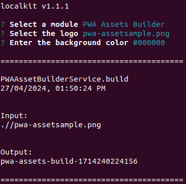

[<- Back](../../../README.md)

# PWA Assets Builder

The PWA Assets Builder Module generates all the assets needed for a Progressive Web Application to be published correctly across different devices, operating systems, social networks, etc.


## Getting Started

In order to generate a build, you need:

1. The brand's color in hexadecimal format (e.g. `#000000`) that will be used for the background
2. The brand's icon in `.png` format and dimensions of `1024x1024` pixels. For example:


**Important:** make sure there is sufficient color contrast between the background and the icon.

Launch the CLI in the directory where the required image is located and then initialize the PWA Assets Builder Module:

```bash
$ localkit
```




## Build Output

Once the build has completed, it will output the following contents in the directory from which you invoked the CLI:

```
pwa-assets-build-${TIMESTAMP}
    │
    manifest.webmanifest
    receipt.txt
    source.png
    pwa-assets/
        ├───icons/
        |      ├───16x16.png
        |      ├───20x20.png
        |      ├───24x24.png
        |      ├───30x30.png
        |      ├───32x32.png
        |      ├───36x36.png
        |      ├───40x40.png
        |      ├───44x44.png
        |      ├───48x48.png
        |      ├───50x50.png
        |      ├───55x55.png
        |      ├───60x60.png
        |      ├───63x63.png
        |      ├───64x64.png
        |      ├───66x66.png
        |      ├───71x71.png
        |      ├───72x72.png
        |      ├───75x75.png
        |      ├───80x80.png
        |      ├───88x88.png
        |      ├───89x89.png
        |      ├───96x96.png
        |      ├───100x100.png
        |      ├───107x107.png
        |      ├───120x120.png
        |      ├───128x128.png
        |      ├───142x142.png
        |      ├───144x144.png
        |      ├───150x150.png
        |      ├───152x152.png
        |      ├───168x168.png
        |      ├───176x176.png
        |      ├───180x180.png
        |      ├───188x188.png
        |      ├───192x192.png
        |      ├───200x200.png
        |      ├───225x225.png
        |      ├───256x256.png
        |      ├───284x284.png
        |      ├───300x300.png
        |      ├───310x150.png
        |      ├───310x310.png
        |      ├───384x384.png
        |      ├───388x188.png
        |      ├───388x388.png
        |      ├───465x225.png
        |      ├───465x465.png
        |      ├───512x512.png
        |      ├───600x600.png
        |      ├───620x300.png
        |      ├───620x620.png
        |      ├───775x375.png
        |      ├───930x450.png
        |      ├───1024x1024.png
        |      ├───1240x600.png
        |      ├───1240x1240.png
        |      └───2480x1200.png
        ├───apple-touch-icons/
        |      ├───16x16.png
        |      ├───20x20.png
        |      ├───29x29.png
        |      ├───32x32.png
        |      ├───40x40.png
        |      ├───50x50.png
        |      ├───57x57.png
        |      ├───58x58.png
        |      ├───60x60.png
        |      ├───64x64.png
        |      ├───72x72.png
        |      ├───76x76.png
        |      ├───80x80.png
        |      ├───87x87.png
        |      ├───100x100.png
        |      ├───114x114.png
        |      ├───120x120.png
        |      ├───128x128.png
        |      ├───144x144.png
        |      ├───152x152.png
        |      ├───167x167.png
        |      ├───180x180.png
        |      ├───192x192.png
        |      ├───256x256.png
        |      ├───512x512.png
        |      └───1024x1024.png
        ├───apple-splash-screens/
        |      ├───640x1136.png
        |      ├───750x1334.png
        |      ├───828x1792.png
        |      ├───1125x2436.png
        |      ├───1136x640.png
        |      ├───1242x2208.png
        |      ├───1242x2688.png
        |      ├───1334x750.png
        |      ├───1536x2048.png
        |      ├───1668x2224.png
        |      ├───1668x2388.png
        |      ├───1792x828.png
        |      ├───2048x1536.png
        |      ├───2048x2732.png
        |      ├───2208x1242.png
        |      ├───2224x1668.png
        |      ├───2388x1668.png
        |      ├───2436x1125.png
        |      ├───2688x1242.png
        |      └───2732x2048.png
        ├───telegram/
        |      └───512x512.png
        ├───facebook/
        |      └───720x720.png
        ├───github/
        |      └───500x500.png
        ├───instagram/
        |      └───1000x1000.png
        ├───linkedin/
        |      └───400x400.png
        ├───notification/
        |      └───256x256.png
        ├───twitter/
        |      └───400x400.png
        └───whatsapp/
               └───500x500.png
```


## Usage

@TODO


## Sources

- [Web app manifests | MDN](https://developer.mozilla.org/en-US/docs/Web/Manifest)
- [Web app manifest | web.dev](https://web.dev/learn/pwa/web-app-manifest)
- [App design | web.dev](https://web.dev/learn/pwa/app-design#display_modes)
- [Add a web app manifest | web.dev](https://web.dev/articles/add-manifest)
- [Web Application Manifest | w3c](https://w3c.github.io/manifest/)
- [PWA Builder](https://www.pwabuilder.com/)
- [Adding favicons in a multi-browser multi-platform world](https://mobiforge.com/design-development/adding-favicons-in-a-multi-browser-multi-platform-world)
- [Define icons and a theme color](https://learn.microsoft.com/en-us/microsoft-edge/progressive-web-apps-chromium/how-to/icon-theme-color)
- [Iconography in Windows](https://learn.microsoft.com/en-us/windows/apps/design/style/iconography/overview)