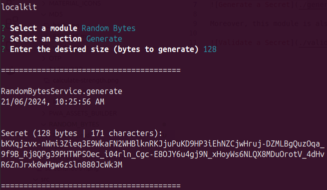
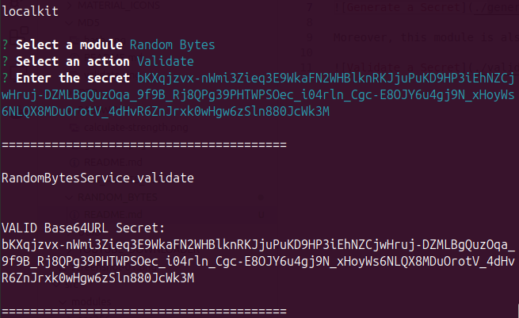

[<- Back](../../../README.md)

# Random Bytes

The Random Bytes Module allows you to generate random sequences of bytes of any size, encoded with the Base64URL scheme.

Moreover, this module is also capable of validating secrets:

