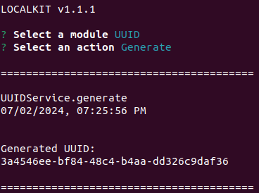
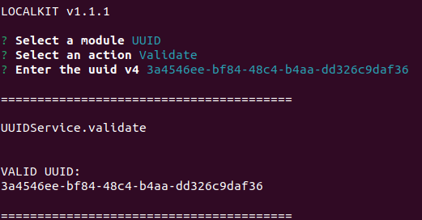

[<- Back](../../../README.md)

# UUID

The UUID Module allows you to generate Universally Unique Identifiers Version 4. It is 
very useful for cases in which you need to hard code data records.

It also allows you to verify if a string is a valid `uuidv4`:

