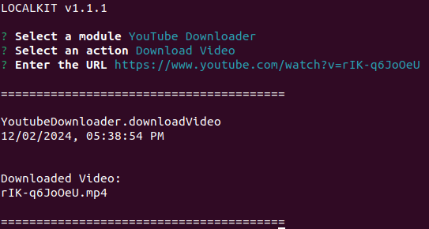
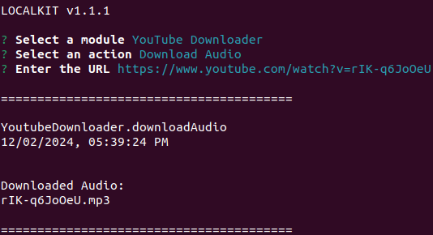

[<- Back](../../../README.md)

# Youtube Downloader

**Ensure your use case complies with [YouTube's Terms of Service](https://www.youtube.com/static?template=terms) before executing this module.**

The Youtube Downloader Module allows you to download content as video (`.mp4`) or audio (`.mp3`) at the highest available resolution directly from Youtube by just entering the desired URL.

You can make use of this module to download an episode of your favorite podcast or a conference you missed and wish to watch offline.

## Downloading Content as Video

## Downloading Content as Audio

